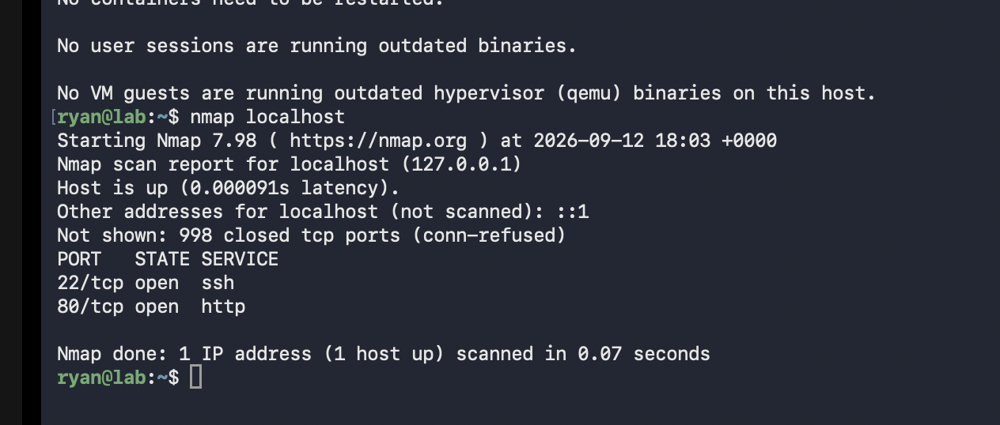

# Day 3: Testing Firewall & Installing Fail2Ban

## Firewall Verification

**Tested UFW rules with nmap:**
```bash
nmap localhost
```

**Result:** Only ports 22, 53, 80, 443 open. All others blocked by firewall. ✅

---

## Installing Fail2Ban

**Install & start IPS:**
```bash
sudo apt install fail2ban -y
sudo systemctl start fail2ban
sudo systemctl enable fail2ban
```

**Verify it's running:**
```bash
sudo systemctl status fail2ban
sudo fail2ban-client status
```

**Output:** Fail2Ban active, monitoring SSH (sshd jail). ✅

---

## What I Learned

✅ Firewall rules verified working  
✅ Fail2Ban installed and monitoring SSH  
✅ Defense in depth = multiple security layers  



---

**Journey Post:** [Instagram](https://www.instagram.com/p/DcY2UuOs5FA/)

**Status:** Firewall + IPS deployed  
**Next:** Day 4 - Attack Simulations

**Status:** Firewall + IPS deployed  
**Next:** Day 4 - Attack Simulations
