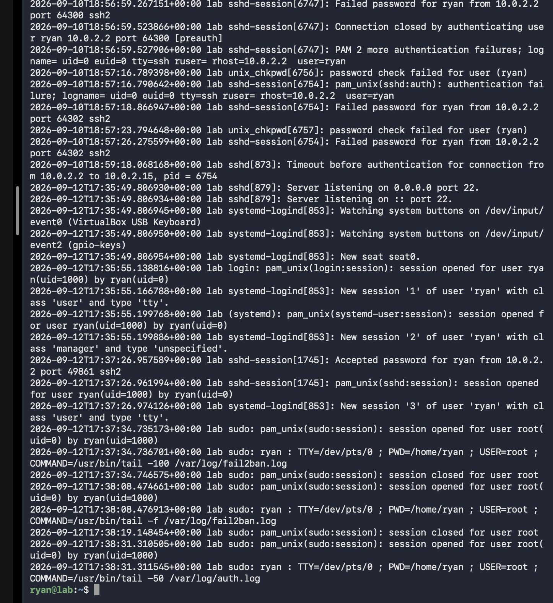

# Day 4: Recovery & Log Monitoring

## MacBook Reset

**Situation:** MacBook broke, had to reset everything  
**Recovery:** Rebuilt entire setup from scratch

---

## Rebuilding Security Stack

**SSH Setup (again):**
```bash
sudo apt install openssh-server -y
sudo systemctl start ssh
sudo systemctl enable ssh
```

**UTM Port Forwarding (again):**
- Host Port: 2222
- Guest Port: 22
- Protocol: TCP

**Verification:** ✅ SSH working again

---

## Fail2Ban Log Monitoring

**Checked live logs:**
```bash
sudo tail -f /var/log/fail2ban.log
```

**Evidence in logs:**
- Multiple failed SSH login attempts detected
- Connection timeouts recorded
- Failed password attempts for user 'ryan'
- System automatically tracking intrusion attempts

✅ Fail2Ban actively monitoring and logging attacks

**Auth logs also showed:**
- Failed authentication attempts
- Successful logins after correct credentials
- Session management events
- Complete audit trail of all SSH activity


*Live system logs showing failed login attempts and Fail2Ban monitoring*

---

## Attempted Wazuh Integration

**Goal:** Deploy Wazuh SIEM for centralized log monitoring  
**Result:** ❌ Failed - M1 ARM compatibility issues (similar to pfSense)

**Lesson:** Not all security tools support ARM architecture. Will explore alternatives.

---

## What I Learned

✅ Can rebuild security stack quickly when needed  
✅ Fail2Ban logs show real attack attempts (not theoretical)  
✅ Complete audit trail = critical for security  
✅ Some enterprise tools not yet ARM-optimized  
✅ System hardening actually working - blocking attackers  

---

## Time Investment
- SSH rebuild: 10 mins
- Port forwarding: 5 mins
- Log analysis: 20 mins
- Wazuh attempt: 15 mins
- **Total: 50 mins**

---

**Status:** Security stack rebuilt and operational  
**Logs:** Proving system is detecting threats  
**Next:** Explore lightweight SIEM alternatives or continue with log-based monitoring

---

**Journey Post:** [Instagram](https://www.instagram.com/p/DdCgloCMXgz/)
